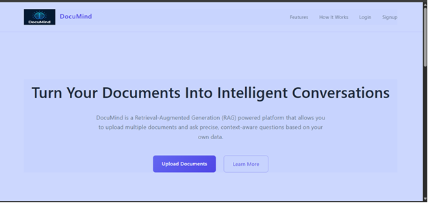
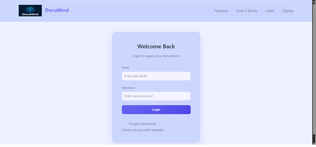
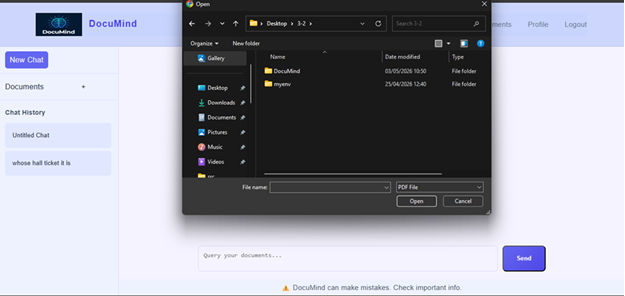
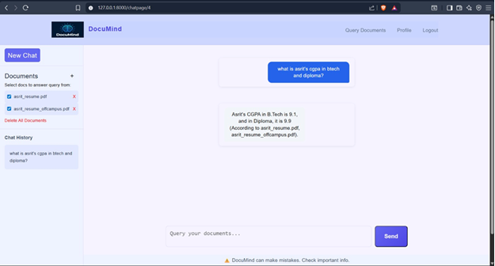

# DocuMind — Intelligent Document Retrieval using RAG

> Upload documents. Ask questions. Get precise, grounded answers.

DocuMind is a **Retrieval-Augmented Generation (RAG)** based system that enables users to upload documents and query them using natural language. It processes documents through text extraction, preprocessing, chunking, and embedding, and stores them in a per-user FAISS vector index for efficient semantic search.

The system implements controlled retrieval with top-k selection, similarity thresholding, and context filtering to minimize hallucinations. An intent classifier (Logistic Regression) distinguishes in-domain from out-of-domain queries, ensuring reliable and grounded responses.

---

## Features

- **Secure Document Upload** — Handles edge cases and validates documents before processing
- **Text Preprocessing & Chunking** — Cleans, segments, and maps metadata for each document
- **Per-User FAISS Indexing** — Each user gets an isolated vector index with incremental update support
- **Semantic Search** — Retrieves relevant chunks using embedding similarity with configurable thresholds
- **Context-Aware LLM Responses** — Prompt-controlled generation grounded strictly in retrieved context
- **Intent Classification** — Logistic Regression model filters out-of-domain queries before retrieval
- **Query Logging & Monitoring** — Tracks queries and system activity for observability

---

## Tech Stack

| Layer | Technology |
|---|---|
| Backend | Django |
| Vector Database | FAISS |
| ML / Intent Classifier | Scikit-learn (Logistic Regression) |
| LLM Integration | API-based |
| Database | SQLite |

---

## Pipeline

```
Upload → Preprocess → Chunk → Embed → Store (FAISS)
                                            ↓
Answer ← LLM ← Filter ← Retrieve ← Embed ← Intent ← Query
```

1. **Upload** — User uploads a document
2. **Preprocess** — Text is extracted and cleaned
3. **Chunk** — Document is split into overlapping segments with metadata
4. **Embed** — Chunks are converted to vector embeddings
5. **Store** — Embeddings are saved to the user's FAISS index
6. **Query** — User submits a natural language question
7. **Intent** — Classifier validates the query is in-domain
8. **Embed** — Query is embedded in the same vector space
9. **Retrieve** — Top-k similar chunks are fetched from FAISS
10. **Filter** — Low-similarity chunks are dropped via threshold
11. **LLM** — Retrieved context is passed to the LLM with prompt controls
12. **Answer** — Grounded response is returned to the user

---

## Project Structure

```
DocuMind/
├── backend/
│   ├── api/               # Django REST API views and routes
│   ├── retrieval/         # FAISS indexing and semantic search
│   ├── classifier/        # Intent classification model
│   ├── processing/        # Text extraction, chunking, embedding
│   └── monitoring/        # Query logging and system monitoring
├── db.sqlite3
├── manage.py
└── requirements.txt
```

---

## Getting Started

### Prerequisites

- Python 3.9+
- pip

### Installation

```bash
# Clone the repository
git clone https://github.com/LMeghanath/DocuMind.git
cd DocuMind

# Create a virtual environment
python -m venv venv
source venv/bin/activate  # On Windows: venv\Scripts\activate

# Install dependencies
pip install -r requirements.txt
```

### Configuration

Create a `.env` file in the root directory:

```env
LLM_API_KEY=your_api_key_here
LLM_API_URL=your_llm_endpoint
```

### Run the Server

```bash
python manage.py migrate
python manage.py runserver
```

---
## Screenshots

### Home Page


### Login Page


### Document Upload


### Query Screen


---
## License

This project is licensed under the [MIT License](LICENSE).

---

## Authors

L Meghanath Sri Satyanarayana
